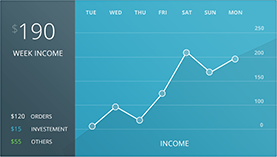

# Project 3

## Introduction
This project is for advanced control development.
To start with this project you need to have completed Level 3 training and have a good understanding on writing performance driven DOM controls.
Level 4 performance training is strongly advised.

## Goals
Write a web component that will encapsulate the features defined below and represent the design given.

## Design

## Features
The component is a week income summary component.
It shows the following income type information:

1. Orders
2. Investment
3. Other

These are shown at the bottom left corner of the control and are summaries for the week's information.
At the top left of the control those items are summed giving you the week total.

The control has a income property that is bound to.
The income object has three properties, one for each income type as defined above.

The control needs to do what ever calculations are required and display the chart as per the design.

Make the X-Axis the days of the week:
Sunday Monday Tuesday.. Saterday.
This is a deviation from the design but more standard.

Make the Y-Axis the values of income, incremented by 50.
This will have to be updated to a larger value if the max value is over 250.
In that case divide the max value by 5 and round it to the next 10 for a offset value.

If the collection changes, all the values including the chart need to be updated.
Chart updates should be animated.

## Performance
Performance is a key.
Prevent dom thrashing, reflows and repaints at all cost.
You can not use a library.